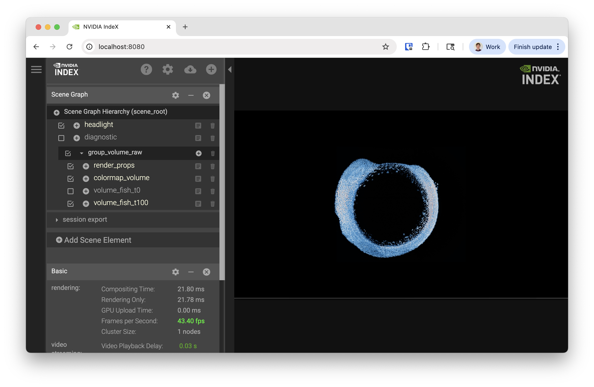
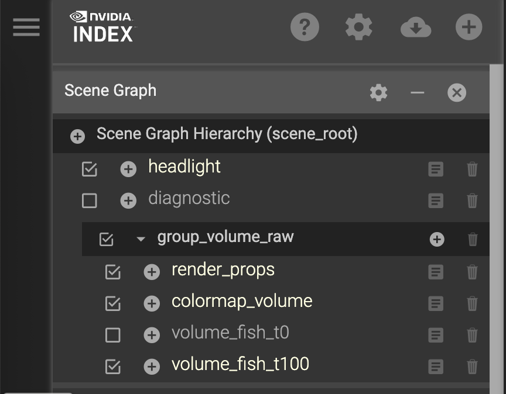
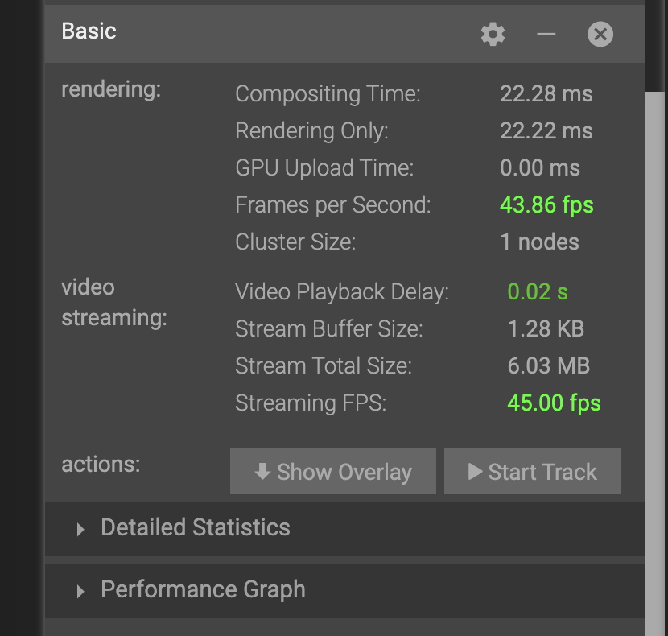
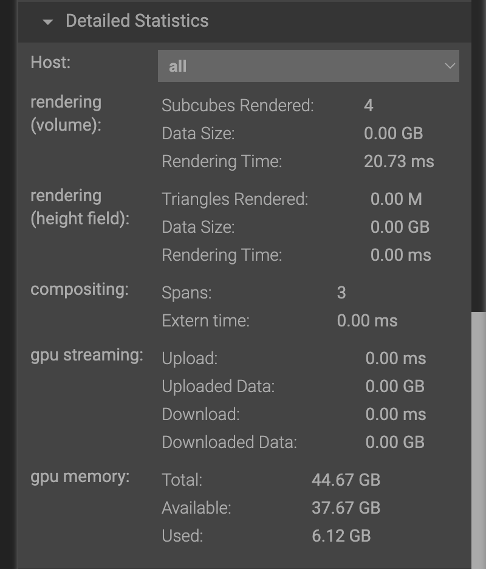
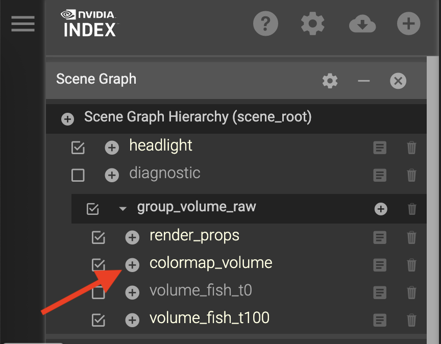
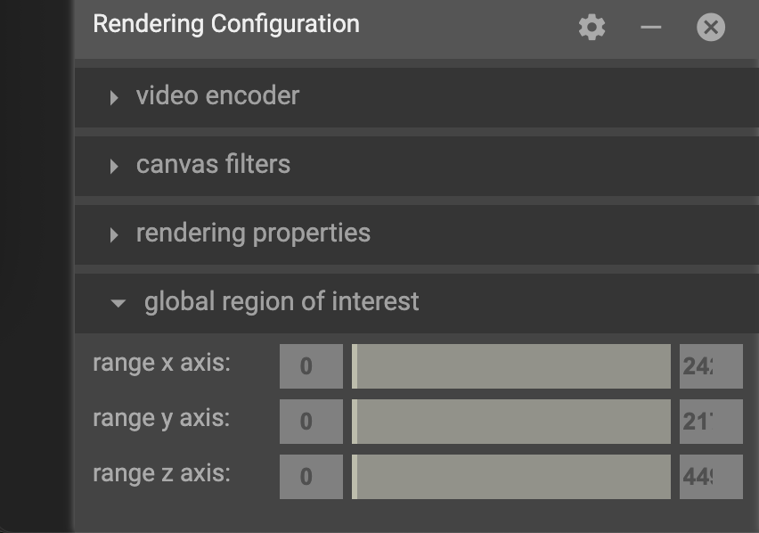

IndeX on Slurm
=====================

This tutorial introduces how to use the `NVIDIA IndeX <https://developer.nvidia.com/index>`_ viewer with various data formats.

**Objectives**

* Introduction to IndeX
* Launching the IndeX viewer on a remote system
* Learn about the IndeX viewer interface with data
* Explore the pros/cons of different data formats:

  * `ZARR <https://zarr.dev/>`_
  * binary (RAW)
  * VDB
  * NanoVDB

* Export visuals and create animations
* Launch multi-node rendering

**Requirements**

* Recent release of NVIDIA IndeX SDK (newer than 2020)
* Slurm system

Introduction to IndeX
-----------------------

NVIDIA IndeX is a powerful 3D volumetric visualization SDK designed for interactive exploration of massive scientific datasets.
It enables researchers, scientists, and engineers to visualize and analyze extremely large volumetric data in real-time, leveraging the parallel processing capabilities of NVIDIA GPUs.

Launching the IndeX viewer on a remote system
-----------------------------------------------

For this tutorial, IndeX has been installed as a system module containing:

* IndeX
* IndeX web viewer
* IndeX plugins
* ZARR python package (not distributed with IndeX)

IndeX can also be run from it's release directory using a binary that compatible with your system architecture (e.g. linux-x86-64, linux-aarch64).
You may also need to install the ZARR python library to convert your data to RAW format.

After logging into your cluster, and while still on the login node, load the ``index`` module as follows:

.. code-block:: shell
  
  # Take a look at all versions
  module spider index

  # Look at what gets set
  module show index

  # Load the default index module
  module load index

Loading the module now allows it to be inherited in any interactive jobs you run from the same session.

IndeX is computationally intensive, so it should always be run inside a job from a compute node with at least one GPU.
We also recommend that your job have at least the same amount of CPU memory as GPU memory (CPU mem >= total GPU mem).

Start an interactive job with the following:

.. code-block:: shell

  # Start a 3 hour interactive job with 1 GPU
  srun -p index -n 1 -G 1 --cpus-per-task 8 -t 03:00:00 --pty bash -l

.. note::

  You may need to tailor the partition (``-p``) and memory (``--mem-per-gpu``) for your cluster

At this point, your command prompt should change from a login node to a compute node.

Creating the demo environment
###############################

While on your compute node, unpack the demo environment that contains the HTML viewer demo and scenes files.

.. code-block:: shell

  # Copy scenes
  cp -R /hpc/mydata/greg.zynda/index_workshop/scenes .
  # Copy HTML viewer demo
  cp -R $NVINDEX_DIR/demo .
  
  

  # Start basic viewer
  cd demo
  bash $IDX_SCENES/scene_zebrafish_basic.sh

Like many NVIDIA products, IndeX is meant to be used as an API.
We're going to be running everything from the demo directory because it's a demonstration of an HTML viewer that can be built in IndeX.
The fact that it can be successfully used to view microscopy data is a perk.

After running the final bash script, you should see a long ending in the following

.. code-block:: shell

  Mon, 29 Sep 2025 14:32:18 -0700 VIEWER main info : **********************************************************************
  Mon, 29 Sep 2025 14:32:18 -0700 VIEWER main info : HTTP server is running at http://gpu-sm01-08.clusternet:8080/
  Mon, 29 Sep 2025 14:32:18 -0700 VIEWER main info : **********************************************************************

If that URL works, the compute nodes for your cluster are accessible from your internal network.
If not, you'll need to forward the IndeX viewer port to your local system.

Forwarding ports
###################

There are several ways to do this, but I recommend `local port forwarding <https://www.digitalocean.com/community/tutorials/ssh-port-forwarding#local-port-forwarding-ssh-l>`_.
Local port forwarding creates a secure tunnel between a port on your local machine and a remote server using ssh.

This can be done using the same ssh command used to connect to remote servers and has the format:

.. code-block:: shell

  ssh -L [local_port]:[destination_address]:[destination_port] [username]@[ssh_server]

+---------------------+----------------------------------------------------------------------+
| Field               | Description                                                          |
+=====================+======================================================================+
| local_port          | The port on your local machine that you will connect to              |
+---------------------+----------------------------------------------------------------------+
| destination_address | The address of the machine hosting the service on the remote network |
+---------------------+----------------------------------------------------------------------+
| destination_port    | The port the remote service is listening on                          |
+---------------------+----------------------------------------------------------------------+
| username            | Your username to connect to the system                               |
+---------------------+----------------------------------------------------------------------+
| ssh_server          | The cluster address                                                  |
+---------------------+----------------------------------------------------------------------+

In my case, I'm going to run the following

.. code-block:: shell

  ssh -L 8080:gpu-sm01-08:8080 [username]@[ssh_server]

This will leave you with an active terminal session on that server.
Closing this terminal will stop the port forwarding, so please leave it open for the duration of the tutorial.

You should now be able to visit http://localhost:8080 in your browser and see the following

  
Exploring IndeX viewer interface
--------------------------------------------

Starting from

Scene Graph
###############

We're going to start with the Scene Graph in the upper-right corner of the interface

Different dimensions or layers of data can be enabled for rendering by clicking the check boxes.
We currently have two data layers:

* volume_fish_t0
* volume_fish_t100

Try swapping between them.
You will notice some lag because the data files are unloaded and loaded.

Performance Statistics
###################

Scrolling down to the Basic statistics section

you'll notice the following metrics:

* rendering

  * Frames per second: How quickly IndeX can render the data
  * Cluster Size: Number of nodes running IndeX

* video streaming

  * Streaming FPS: How quickly frames can be transmitted to your computer

If you expand the Detailed Statistics section, you can also see detailed information about memory utilization.

Moving around the scene
##########################

This visualization is interactive and your view can change based on the following actions:

========= =================
Motion    Action
========= =================
Rotate    Click+Drag
Zoom      Shit+Click+Drag
Moving    CMD+Click+Drag
========= =================

Colormap
#############

View the colormap by clicking the plus (+) button from the scene list

Looking at the pane that shows up

.. image:: assets/index_colormap.png
  :scale: 50 %
  :align: center

The x-axis of the colormap graph is the data value, and y-axis of the graph is the opacity.
For this color map, low values are mapped to red, and transition to blue as the value increases.
By default, low values are almost transparent while mid to high transitions to opaque.

Try clicking around on the color map to see what happens.
After you start to understand how this changes your view of the data, try the following:

* View the lower 30% of the data
* Exclude the lower 30% of the data
* Highlight middle values of data

If you end up creating a color map that you love, you can copy the config to your clipboard or export it to a file.
Alternatively, if you want to get back to the default colormap, just restart the viewer.

Slicing the data view
########################

Data can also be sliced to a specific region using the by specifying a global region of interest in the rendering configuration.
If you experiment with these values, you'll notice the visualization get clipped based on the bounds you choose.

Shutting down the viewer
###########################

If you need to restart the view or you're just done interacting with data, the viewer service can be shut down by:

* Pressing Ctrl+C on the CLI
* Choosing "Shutdown Viewer" from the hamburger (☰) menu

Exploring different data formats
---------------------------------

IndeX can accept several different input types through the scene (``.prj``) files.
Some are native, while others use plug-ins.

RAW uint16
################

This original demo was using binary (RAW) format with uint16 values.

OpenVDB (.vdb)
#################

OpenVDB is a sparse volumetric data structure and file format with the ``.vdb`` extension.
Since this is a sparse data structure, only non-zero values are stored in the file.
This means that volumes like this, where there's a lot of empty space can be much smaller without losing any data.

Data has already been converted for the tutorial today, but the ``converter_raw_to_vdb`` binary can used to convert the RAW uint16 data to VDB format.
Be aware that this converter has a non-zero threshold, so some data is filtered out by default.
Set this to ``-1`` if you need a lossless conversion.

Lets explore this data and others by launching

.. code:: shell

  # From the demo directory
  bash $IDX_SCENE/scene_zebrafish_nanovdb.sh

NanoVDB (.nvdb)
####################

NanoVDB is a lightweight, GPU-friendly version of OpenVDB developed by NVIDIA.
One of the main differences is that NanoVDB has a static, linearized memory layout with baked offsets, allowing for faster random access and better cache coherency.

In addition to the sparse filtering that OpenVDB supports, NanoVDB also allows for reduced precision.
Both of these methods are lossy, where you're either throwing out whole data points or reducing the precision of them.
Our data has a maximum of 0.003, so this is important to think about.

After comparing the performance of the formats, take a look at the size with

.. code:: shell

  ls -lh $IDX_DATA/zebrafish-sample/*

In the ``nvdb`` directory, you can see the effect of different precision levels with ``fp`` and the effect of different filtering thresholds with the ``ts-*_``.

ZARR
#########

ZARR files can also be loaded directly.
Launch this with:

.. code:: shell

  bash $IDX_SCENE/scene_zebrafish_zarr.sh

Comparison
##############

Using a single A10 GPU, performance was recorded

========== ===================== =======================
Format     Rendering FPS (idle)  File Size (GB)
========== ===================== =======================
RAW uint16 10                    4.4
VDB        16                    1
NVDB fp16  30                    2.2
NVDB fp8   37                    1.2
ZARR       14                    202 (all time steps)
========== ===================== =======================

Exporting visuals and creating animations
-----------------------------------------

TBD

Launching multi-node rendering jobs
-------------------------------------

.. code:: shell

  # After loading the index module
  srun -p gpu -N 2 -n 4 -G 4 --cpus-per-task 16 -t 00:30:00 nvindex-slurm $IDX_SCENE/scene_zebrafish_basic.sh