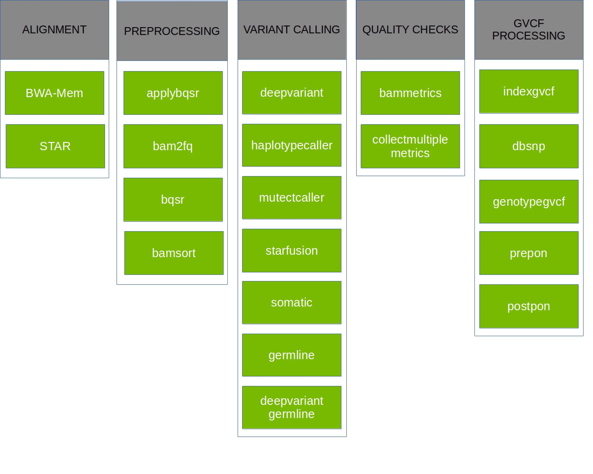

Parabricks Workshop
=====================

This course introduces `NVIDIA Clara™ Parabricks® <https://www.nvidia.com/en-us/clara/genomics/>`_ for read alignment and variant calling to demonstrate the benefits of GPU acceleration.

Course objectives
-----------------

As DNA sequencing has decreased in price, experiments have often been designed to use deeper coverage or more samples. This means more data is being produced and more time is spent on the bioinformatics analysis. CPU-based tools are commonly used for both read alignment and variant calling. However, significant time can be saved when GPU-accelerated tools are used. This will be demonstrated with NVIDIA Parabricks with the following steps:

* DNA alignment with fq2bam
* Calling variants with haplotypecaller
* Potential downstream analyses

This tutorial will show you how to run our core alignment tool, FQ2BAM, which allows you to align a FASTQ file according to GATK best practices at blazing speeds. This includes the gold-standard alignment tool BWA-MEM with inbuilt co-ordinate sorting of the output file, and optionally application of base-quality-score-recalibration and marking of duplicate reads.

Requirements
------------

* NVIDIA GPU and driver greater than version 465.32.*
* Container runtime that supports NVIDIA GPUs and Docker containers:

  * `Docker <https://docs.docker.com/get-docker/>`_
  * `Apptainer <https://apptainer.org/>`_
  * `Enroot <https://github.com/NVIDIA/enroot>`_

Data Used
-------------------

This tutorial will be using single-end reads from two strains of *Arabidopsis thaliana* from the `1001 Genomes project <https://1001genomes.org/index.html>`_:

* `Bay-0 <https://1001genomes.org/data/JGI/JGIHeazlewood2008/releases/2011_11_15/TAIR10/strains/Bay-0>`_
* `Shadahara <https://1001genomes.org/data/JGI/JGIHeazlewood2008/releases/2011_11_15/TAIR10/strains/Sha/>`_

The bam files were converted to fastq and down-sampled to 20M reads using samtools and seqtk to reduce runtime for this tutorial.

.. code-block:: shell

    samtools fastq <sample>.bam > <sample>.fastq
    seqtk sample <sample>.fastq 20000000 > <sample>_20M.fastq

Introduction to Clara Parabricks
--------------------------------

NVIDIA Clara™ Parabricks® is a software suite for the secondary analysis (alignment, variant calling) of DNA and RNA from short and long reads on GPU-accelerated hardware. On the most performant platforms, Clara Parabricks can analyze a typical whole human genome dataset in about 25 minutes, instead of 30 hours for other methods. It was designed to be easy to run while also matching the output from commonly used software, which means analyses can be reproduced even without GPUs.

Parabricks v4 supports a variety of GPU-accelerated secondary analyses: alignment, preprocessing, variant calling, QC, and even some variant annotation (which lies in tertiary analysis). The chart below shows each pipeline supported in Parabricks v4.0.1-1, but take a look at `the documentation <https://docs.nvidia.com/clara/parabricks/4.0.1/documentation/tooldocs/standalonetools.html>`_ for more information.

Getting Clara Parabricks
########################

Clara Parabricks is available as a container on NGC. 

https://catalog.ngc.nvidia.com/orgs/nvidia/teams/clara/containers/clara-parabricks

This tutorial will be using ``v4.0.1-1`` of the container, so please pull it to your system as follows:

.. code-block:: shell

    # Docker
    docker pull nvcr.io/nvidia/clara/clara-parabricks:4.0.1-1

    # apptainer
    apptainer pull docker://nvcr.io/nvidia/clara/clara-parabricks:4.0.1-1

.. note::

    Since there are many ways to invoke the parabricks container, all example commands will omit container runtime commands. If you are using apptainer/singularity, make sure to include the ``--nv`` flag to mount NVIDIA libraries and devices.

Preparing your environment
##########################

To streamline this workshop, a modulefile was created with helper variables and functions for calling singularity containers. Please load it with:

.. code-block:: shell

    module use /scratch/user/u.gz28467/modulefiles
    module load tutorial/latest

DNA alignment with fq2bam
-------------------------

Unless you're starting with pre-aligned reads in a ``.bam`` file, the first step to many bioinformatics pipelines is alignment. Parabricks has the `fq2bam <https://docs.nvidia.com/clara/parabricks/4.0.1/documentation/tooldocs/man_fq2bam.html#man-fq2bam>`_ pipeline for DNA (based on bwa mem) and the `rna_fq2bam <https://docs.nvidia.com/clara/parabricks/4.0.1/documentation/tooldocs/man_rna_fq2bam.html#man-rna-fq2bam>`_ pipeline for RNA (based on STAR). This tutorial uses DNA inputs and will focus on fq2bam.

When fq2bam is run, reads (compressed or not) are aligned by GPU-bwa mem, alignments are sorted by coordinate, duplicates are marked, and Base Quality Score Recalibration (BQSR) is performed, and a final ``.bam`` file is output.

.. image:: https://docscontent.nvidia.com/dims4/default/07eaa76/2147483647/strip/true/crop/1230x402+0+0/resize/2460x804!/format/webp/quality/90/?url=https%3A%2F%2Fk3-prod-nvidia-docs.s3.amazonaws.com%2Fbrightspot%2Fsphinx%2F00000186-7a40-d64e-abe6-fa7020f90000%2Fclara%2Fparabricks%2F4.0.1%2F_images%2Ffq2bam.png

Depending on how you need to process your sample, fq2bam has a `lot of options <https://docs.nvidia.com/clara/parabricks/4.0.1/documentation/tooldocs/man_fq2bam.html#fq2bam-reference>`_. Since the data used in this tutorial is single-ended, we're going to be using:

  --ref REF             Path to the reference file. (default: None)
  --in-se-fq [IN_SE_FQ [IN_SE_FQ ...]]
                        Path to the single-ended FASTQ file followed by optional read group with quotes 
  --out-bam OUT_BAM     Path of a BAM/CRAM file after Marking Duplicates. (default: None)
  --num-gpus NUM_GPUS   Number of GPUs to use for a run. (default: number detected)

.. note::

    For the sake of time, the reference genome we'll be using was already indexed with
    ``bwa index TAIR10_chr_all.fasta``. This will need to be done for any other genomes you use.

Running fq2bam on one GPU
##########################

By default, Parabricks will use all GPUs detected on your system. However, that can be controlled with the ``--num-gpus`` flag. Lets start with one and see how things run.

.. literalinclude:: assets/run_fq2bam.sh
    :caption: :download:`run_fq2bam.sh <assets/run_fq2bam.sh>`

Running fq2bam on two GPUs
##########################

Now run the same pipeline on two GPUs. If you only requested a single GPU through your scheduler, you may need to start a new job.

Is there a larger effect on certain phases?

Running the CPU equivalent
##########################

For every workflow in Clara Parabricks, an equivalent CPU workflow is provided to reproduce results. `fq2bam is no exception <https://docs.nvidia.com/clara/parabricks/4.0.1/documentation/tooldocs/man_fq2bam.html#compatible-cpu-based-bwa-mem-gatk4-commands>`_, and the below example takes those commands and wraps them in a bash function.

.. literalinclude:: assets/run_fq2bam_cpu.sh
    :caption: :download:`run_fq2bam_cpu.sh <assets/run_fq2bam_cpu.sh>`

If you compare the size of the ``.bam`` files created by Parabricks and the CPU pipeline, you'll notice that the CPU pipeline are larger.

.. code-block:: shell

    $ ls -lh *bam
    -rw-rw-r-- 1 u.gz28467 u.gz28467 1.1G Mar  5 17:25 Bay-0_20M_pb.bam
    -rw-rw-r-- 1 u.gz28467 u.gz28467 1.3G Mar  5 17:45 Bay-0_cpu_sorted_marked.bam
    -rw-rw-r-- 1 u.gz28467 u.gz28467 1.1G Mar  5 18:07 Shadara_20M_pb.bam
    -rw-rw-r-- 1 u.gz28467 u.gz28467 1.3G Mar  5 17:52 Shadara_cpu_sorted_marked.bam

This is due to compression levels. If you compare the bam files with samtools, they contain the same number of alignments.

.. code-block:: shell

    $ samtools flagstat Bay-0_20M_pb.bam
    20000000 + 0 in total (QC-passed reads + QC-failed reads)
    20000000 + 0 primary
    0 + 0 secondary
    0 + 0 supplementary
    3314936 + 0 duplicates
    3314936 + 0 primary duplicates
    13577887 + 0 mapped (67.89% : N/A)
    13577887 + 0 primary mapped (67.89% : N/A)

    $ samtools flagstat Bay-0_cpu_sorted_marked.bam 
    20000000 + 0 in total (QC-passed reads + QC-failed reads)
    20000000 + 0 primary
    0 + 0 secondary
    0 + 0 supplementary
    3314936 + 0 duplicates
    3314936 + 0 primary duplicates
    13577887 + 0 mapped (67.89% : N/A)
    13577887 + 0 primary mapped (67.89% : N/A)

Optional Exercises
##########################

* Have you tried using a different number of GPUs?
* What happens if your input reads are compressed?
* Are the reads the same if you view them?

Calling Variants with haplotypeCaller
-------------------------

The Parabricks haplotypeCaller is a re-implementation of the `GATK HaplotypeCaller <https://gatk.broadinstitute.org/hc/en-us/articles/360037225632-HaplotypeCaller>`_, which is used to call germline (inherited) SNPs and indels through the local re-assembly of haplotypes and identify genotypes.

Like humans, `A. thaliana is diploid <https://www.pnas.org/doi/abs/10.1073/pnas.92.24.10831>`_ and has two copies of each chromosome, so at any given location across the genome, all aligned bases are the same (homozygous), or about half of the reads have one base and half have another (heterozygous). The chloroplast (ChrC) is haploid, similar to the sex chromosomes in humans, and cannot be heterozygous.

.. image:: https://docscontent.nvidia.com/sphinx/00000186-7a40-d64e-abe6-fa7020f90000/clara/parabricks/4.0.1/_images/parabricks-web-graphics-1259949-r2-haplotypecaller.svg

Similar to fq2bam, the haplotypeCaller pipeline in Parabricks has `many options <https://docs.nvidia.com/clara/parabricks/4.0.1/documentation/tooldocs/man_haplotypecaller.html#specifying-haplotype-caller-options>`_, but we'll only need to use these:

  --ref REF             Path to the reference file. (default: None)
  --in-bam IN_BAM       Path to the input BAM/CRAM file for variant calling. The argument may also be a local folder containing several bams; each will be processed by 1 GPU in batch mode. (default: None)
  --out-variants OUT_VARIANTS
                        Path of the vcf/g.vcf/gvcf.gz file after variant calling. The argument may also be a local folder in batch mode. (default: None)
  --num-gpus NUM_GPUS   Number of GPUs to use for a run. (default: number detected)

.. note::

    For the sake of time, the reference genome we'll be using was already indexed with
    ``gatk CreateSequenceDictionary -R TAIR10_chr_all.fasta; samtools faidx TAIR10_chr_all.fasta``. This will need to be done for any other genomes you use.

Running haplotypeCaller
#######################

HaplotypeCaller takes the ``.bam`` files created by fq2bam as input, and calls variants on the aligned reads.

.. literalinclude:: assets/run_pb_haplo.sh
    :caption: :download:`run_pb_haplo.sh <assets/run_pb_haplo.sh>`

.. note::

    Alternatively, both fq2bam and haplotypecaller can be run with the `germline pipeline <https://docs.nvidia.com/clara/parabricks/4.0.1/documentation/tooldocs/man_germline.html#man-germline>`_.

Running the CPU equivalent
##########################

The `CPU equivalent of haplotypeCaller <https://docs.nvidia.com/clara/parabricks/4.0.1/documentation/tooldocs/man_haplotypecaller.html#compatible-gatk4-command>`_ only requires a single call to GATK, but it's much more time intensive than the Parabricks version. Once again, the commands have been wrapped in a bash function for easy usage.

.. literalinclude:: assets/run_cpu_haplo.sh
    :caption: :download:`run_cpu_haplo.sh <assets/run_cpu_haplo.sh>`

Optional Exercises
##########################

* Run the germline pipeline
* How much is runtime affected by the number of GPUs?
* Try running `DeepVariant <https://docs.nvidia.com/clara/parabricks/4.0.1/documentation/tooldocs/man_deepvariant.html#man-deepvariant>`_

Annotating and Analyzing Variant Calls
-------------------------

.. code-block:: shell

    tabix -p vcf 1001genomes_snp-short-indel_only_ACGTN.vcf.gz

https://1001genomes.org/accessions-legacy-projects.html
https://1001genomes.org/projects/JGIHeazlewood2008/index.html

